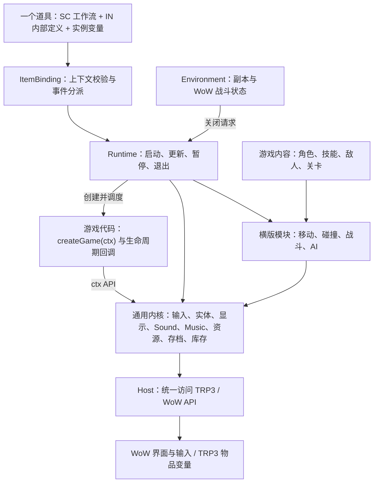

# TRP3 单道具游戏引擎设计

状态：这是架构设计，部分功能仍为规划。0.1.1 已在 WoW 12.1.0 / TRP3E 1061 完成首轮自动基准；0.2.0 有界纹理粒子、共享模型、启动、音频和 Esc/关闭修复待复测。已实现能力见[引擎说明](../framework/item-game/README.md)，操作见[测试项目](../items/performance-lab/README.md)。维护和排错见[维护指南](ITEM-GAME-MAINTENANCE.md)、[FAQ](ITEM-GAME-FAQ.md)。

**开发新游戏先看[游戏开发接入指南](ITEM-GAME-DEVELOPER-GUIDE.md)。** 作者主要写 `item.json`、`content.json` 和返回 `createGame(ctx)` 工厂的 `game.lua`；构建器注册游戏并生成 TRP3 工作流，Runtime 调用游戏回调，游戏通过 `ctx.*` 调用引擎。

本页保留架构概览；各模块的默认功能、拟建 API、宿主接口和实现路径见[模块功能与实现](ITEM-GAME-ENGINE-MODULES.md)。

TRP3 编辑器设置、六个根工作流、内部对象目录、原生事件绑定及完整分发流程见[道具装配设计](ITEM-GAME-ENGINE-TRP3-PACKAGE.md)。

## 1. 目标与边界

玩家已有 TRP3 和 Extended，接收一个道具即可进入游戏。基础玩法、音效与内置音乐无需额外插件或资源包，不依赖 TRP3 战役、任务和剧本变量。自定义 MIDI 音乐优先接入可选的 Musician；未安装时回退内置音乐或无 BGM，不阻止游戏启动。

物品边界使用固定工作流，移动、战斗、动画、关卡切换由 Lua 管理。素材优先使用 WoW 内置模型、纹理和音效。原生交易直接取得背包实例；导出码导入后按原生流程添加到背包，再点击使用。

**前置验证：** 标准 TRP3 沙盒没有完整 GUI API，不能默认存在 `args._G`。0.1.1 按实机反馈修正为“253 字节短宏 → 原生延时 0.1 秒 → Lua”；宏只准备本根物品的短时单次注入，用完或两秒后恢复。构建器按实际 255 字节上限校验，测试使用原生工作流生成器和延时函数；这条启动链已在首轮实机样本中跑通；更换客户端或修改桥接后仍需重新验收。

## 2. 架构

箭头表示职责间的调用。当前实现把 ItemBinding、Environment、Assets、ItemStore 分别放在生成工作流、Host、Runtime 和 View 中；它们不是可直接调用的同名文件/API。完整文件归属见维护指南。玩法只通过 ctx 接入。

## 3. 模块与功能归属

| 层 | 模块 | 负责什么 |
| --- | --- | --- |
| 宿主 | **Host** | GUI 能力检测与启动适配；统一封装界面、时间、输入、声音和 TRP3 变量接口 |
| 接入 | **ItemBinding** | 绑定物品使用/销毁工作流；区分根定义、内部定义和背包实例；读取包清单，向 Runtime 传递本次请求 |
| 开发接口 | **Game SDK / ctx** | 为游戏绑定本场模块、道具和资源作用域；统一 ctx 调用；用工厂创建互相隔离的游戏回调实例 |
| 内核 | **Environment** | 检测副本、WoW 战斗和过图状态；决定能否启动并请求自动关闭 |
| 内核 | **Runtime** | 管理游戏实例与生命周期；唯一主循环；调度模块；退出时统一清理；处理重复启动和版本冲突 |
| 内核 | **Input** | 读取或接管游戏按键，输出小游戏动作；输入缓冲；失焦、聊天、暂停时清空输入并归还控制 |
| 内核 | **World** | 保存实体 ID、位置、速度、生命和动作等运行状态；统一创建、查询和回收实体 |
| 内核 | **View** | 把 World 状态显示为模型或精灵；动画、摄像机、裁剪、层级、血条、菜单与战斗反馈 |
| 内核 | **Assets** | 管理模型、纹理、音效和曲目定义；缓存、预热和缺失占位；管理界面对象池与数量上限 |
| 内核 | **Sound** | 播放 WoW 内置战斗、交互和环境音效；管理播放句柄、限频、优先级和并发；按场次停止 |
| 内核 | **Music** | 管理 BGM、曲目切换、循环和暂停；默认内置音乐，可选 Musician 播放自定义 MIDI；有限音符播放器保留为后续实验 |
| 内核 | **ItemStore** | 读写当前物品的 `o` 变量；存档版本、迁移、校验；只保存进度快照 |
| 内核 | **Inventory / Trade** | 查询 TRP3 材料数量与装备实例；核对发放和消耗；接入原生交易；报价期间冻结本引擎的修改 |
| 横版 | **Motion / Collision** | 移动、重力、跳跃、地面和墙体；碰撞分组、攻击区域接触和高速弹体路径检测 |
| 横版 | **Combat / AI** | 敌人决策；攻击前摇、有效期、后摇；伤害、击退、无敌和重复命中限制；生成战斗事件 |
| 内容 | **GameData / Level** | 定义角色、技能、敌人和关卡数据；配置出生点、地形、刷怪与胜负条件；向 World 创建实体 |
| 开发 | **Tools** | 模块打包、配置校验、版本标识；调试模式下的性能面板、碰撞框、单步与场景重置 |

归属规则：

- **World 保存状态，玩法模块按固定顺序修改状态，View 读取状态。** 显示对象不是游戏状态的来源。
- **Combat 决定何时命中、扣多少血；View 决定怎样表现。** 更换模型不能改变判定。
- **Assets 拥有可复用界面对象，View 申请和归还；Runtime 负责触发整场清理。**
- **只有 Host 接触宿主 API。** 游戏内容不直接访问 `_G`，也不直接读写 TRP3 变量。

## 4. 模块怎样联动

**启动：** 点击道具 → 原生 `onUse` → Host/ItemBinding 检查能力与物品上下文 → 必要时 `wf_bootstrap` 装载引擎并注册游戏 → `wf_open` → Environment 检查副本与战斗限制 → Runtime 检查已有实例、读档并建立 ctx → `createGame(ctx)` → `game.onStart()` 通过 ctx 加载场景/创建角色 → View 显示 → Input 默认读取/透传，玩家主动请求后接管游戏操作。

**每次逻辑更新：** Input 产生快照 → Runtime 调用 `game.onFixedUpdate(dt, input)`，游戏与 AI 提交动作意图 → Combat 推进动作状态 → Motion / Collision 更新位置并检测接触 → Combat 结算命中 → Level / 游戏事件回调判断胜负与切关。

**每帧显示：** View / Sound 读取状态和攻击、受击、死亡等事件，更新动画、血条、飘字和音效。Music 根据场景、战斗阶段或结算事件切换曲目。事件向所有订阅者分发后清空，避免重复播放。

**保存：** 到达检查点、结算或正常退出 → Runtime 在安全保存点调用 `game.onSave()` → 合并引擎管理的数据 → ItemStore 写入当前物品。位置和弹体等高频状态只放内存，不逐帧写存档。

**暂停与恢复：** Runtime 冻结模拟和游戏时间 → Input 清空按键并释放控制 → View 保留场景和暂停菜单 → Sound 停止战斗音效，Music 暂停。恢复时重新接管输入，不补算暂停期间的时间；不能续播的音乐后端从曲首重播。

**退出：** Runtime 停止更新 → Input 释放控制、View 隐藏 → 请求保存 → 取消本场任务、声音和事件订阅 → View 归还对象。保存失败仍执行清理并报告错误；再次打开复用资源，退出操作允许重复调用。

**道具失效：** 手动销毁通过 `LI.OD → wf_destroy` 清理；交易移出、消耗和脚本删除依靠库存复核兜底。已失效或已报价的物品不再写入存档。普通物品的 `HA` 保持空，进本等事件由运行期监听处理。

**进本关闭：** Environment 检测到地下城、团队副本、场景战役、战场或竞技场 → 请求退出；住宅不直接按副本关闭。WoW 进入战斗也自动退出，离开副本或脱战后不自动重开。

**交换：** 暂停并释放输入 → Trade 打开原生交易 → 双方确认 → TRP3 转移物品实例 → Inventory 核对实际库存并刷新游戏。主道具保存进度，材料使用数量，有独立属性的装备使用实例变量。

首版同时只运行一个游戏。重复点击同一道具聚焦已有窗口；切换其他游戏先保存并关闭当前场次。不同版本不能覆盖正在运行的代码。

**音乐后端：** 0.1.2 原生 BGM 默认走 SFX，曲目可指定 Music；尊重对应声音设置，不修改全局 CVar。自定义曲目由开发时将 MIDI 转成 Musician 曲目数据并随道具打包，玩家可选安装 Musician。无需 MusicianList 或额外 MIDI 插件。只播放本机背景音乐，不自动广播演奏；关闭时只停止本游戏创建的声音与曲目。

自建 MIDI 不能只解决音符计时：还需要足够的定音乐源。道具文本不能直接变成音频文件，当前已核对接口未提供可依赖的通用合成器。首版不把完整 MIDI 播放器列为前置工作。

## 5. 统一维护与打包

开发时分模块维护，发布时先生成完整脚本，再装配 `SC / LI / IN / US` 和元数据，产出可导入的完整根道具包。运行时不依赖本地 `require`；生成物携带引擎版本、游戏版本和存档版本。玩家不需要额外接收“引擎道具”或“素材道具”。

根工作流固定为 `onUse`、`wf_bootstrap`、`wf_open`、`wf_stop`、`wf_help`、`wf_destroy`。内部对象存放说明、清单、配置、关卡、素材/曲目和材料/装备定义；它们不会因为被导入而自动运行，也不是存档容器。

现有目录：`framework/item-game/` 放平铺 Lua 引擎模块，`items/<游戏名>/` 放玩法和道具入口，`tools/` 放打包工具。游戏接入以开发指南为准。

一款新游戏的 `item.json` 声明入口和版本，`content.json` 声明角色、技能、关卡和素材，`game.lua` 返回本场游戏工厂。构建器把工厂与引擎打入 `wf_bootstrap` 并生成 `Engine.registerGame(...)`；配置自动分配到对应 `IN`。游戏作者不手工维护六个根工作流。

现有 Octopus 通过适配按需复用；其使用 `c` 战役变量的存储层不能直接作为新存档层。Ovo 的逐像素纹理方案不作为默认战斗渲染器。

存档默认随物品保存，不跨副本同步。主道具和带属性的装备禁止堆叠：当前上游拆堆不复制变量，合堆不比较变量。原生交易有传递实例变量的源码路径；分享模板、复制道具、导入升级和交易异常是否保留进度，仍需分别实测。

## 6. 首版交付与验证

上述核心能力、模板构建与性能台已有实现；首轮已跑通启动和自动负载。接下来制作独立玩法时，从三文件接入开始，补齐具体游戏的交互、音频和持久化验收；库存交易需要双客户端另测。自动基准完成不等于所有规划功能已实现。

主循环采用固定逻辑步长，显示按帧更新，限制卡顿后的补算次数；界面对象复用。记录模块耗时、整体帧耗时、实体与界面对象数量，逐级测试纹理、模型、敌人和弹体容量，不预先承诺性能上限。

验收重点：接收道具后独立启动；移动攻击正常；关闭后无输入和更新残留；重开可恢复进度；替换角色、技能、关卡配置即可打包第二份独立道具。

首版暂不建设实时多人同步、复杂物理和可视化关卡编辑器。
