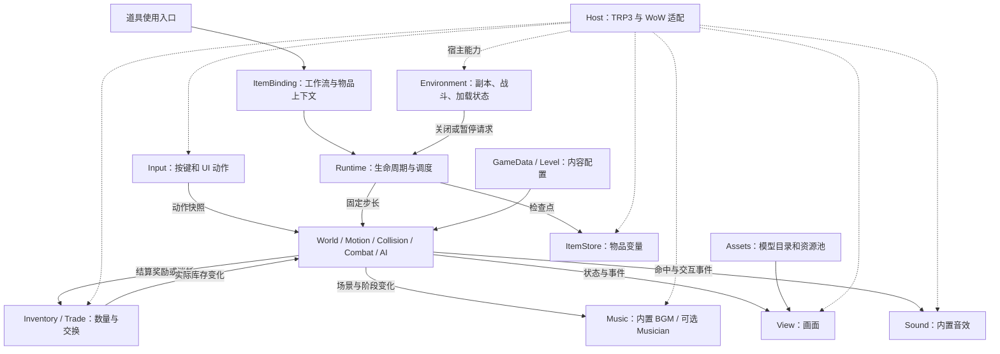

# TRP3 单道具游戏引擎：模块功能与实现

状态：本文保留完整设计目标；ItemGame 0.1 已实现其中的核心能力，实际接口和暂未支持部分以[引擎说明](../framework/item-game/README.md)为准，不能把下文所有拟建接口当作已实现。已有 WoW 12.1.0 / TRP3E 1061 的首轮自动基准样本；新版音频修复和未覆盖流程仍需实测。维护与排错见[维护指南](ITEM-GAME-MAINTENANCE.md)、[FAQ](ITEM-GAME-FAQ.md)。标明 `TRP3_API`、WoW 函数或 Frame 方法的才是宿主接口。

本文描述内部模块能力；游戏作者统一通过绑定本场上下文的 `ctx.*` 门面调用。游戏目录、工厂函数、注册和完整调用示例见[游戏开发接入指南](ITEM-GAME-DEVELOPER-GUIDE.md)。

工作流、内部对象、编辑器字段和原生事件按[TRP3 道具装配设计](ITEM-GAME-ENGINE-TRP3-PACKAGE.md)落地，不能只生成一份 Lua 文件后把装配留给玩家。

## 1. 默认行为

| 事项 | 默认规则 |
| --- | --- |
| 安装与启动 | 一个主道具包含引擎和玩法；基础体验无需额外插件、资源包或战役；自定义 MIDI 音乐可选 Musician；启动桥接已在首轮样本跑通，改动后须复测 |
| 游戏实例 | 同时运行一个；重复点击聚焦已有窗口；切换道具先结束当前游戏 |
| 输入 | 当前默认读取/透传；玩家主动请求后接管游戏按键；退出归还控制 |
| 输入输出范围 | 读取宿主允许查询的键；输出为小游戏动作和事件，不模拟系统按键或驱动 WoW 移动、施法 |
| 存档 | 进度写主道具的 `o` 变量；不使用 `c` 战役变量；主道具禁止堆叠 |
| 数量与交换 | 可交换材料的数量以 TRP3 库存为准；有独立属性的装备禁止堆叠；使用 TRP3 原生交易窗口 |
| 自动退出 | 进入地下城、团队副本、场景战役、战场、竞技场，或角色进入 WoW 战斗时自动关闭；不自动重开 |
| 素材与碰撞 | 内置模型/纹理 + 资产配置；逻辑碰撞体单独定义；模型包围盒用于校准 |
| Sound | 使用 WoW 内置音效，按场次管理句柄；限频、限并发；不依赖 Musician |
| Music | 0.1.2 内置 BGM 默认 SFX，可显式 Music；不修改声音设置。Musician 可选，缺失时走已配置回退或无音乐 |
| 模拟与显示 | 首版逻辑按 60 Hz 固定步长设计，保留 30 Hz 配置；显示跟随客户端帧率；这是参数目标，不是性能承诺 |

“道具量”同时覆盖两种数据：**变量保存复杂状态，数量表示同类材料的份数**。经验、装备词条、设置不编码到堆叠数量里。

## 2. 架构与数据归属



| 数据 | 唯一归属 | 其他模块怎样使用 |
| --- | --- | --- |
| 当前运行阶段、计时、任务和订阅 | Runtime | 模块注册到本场资源作用域，关闭时一起回收 |
| 实体位置、速度、生命、动作状态 | World | Motion、Combat、AI 按调度阶段更新，View 读取 |
| 物品进度、设置、资产收藏 | ItemStore | 先读为运行数据，按检查点保存快照 |
| TRP3 材料数量、装备实例 | TRP3 库存，经 Inventory 访问 | 游戏可缓存显示，不保存第二份可独立消费的余额 |
| 资产定义、动作映射、碰撞模板、音效与曲目配置 | GameData 的版本化配置 | Assets 解析，View、Collision、Sound、Music 分别消费 |
| Frame、Texture、模型 Actor | Assets / View | Runtime 触发清理，模块只释放自己申请的资源 |
| 音效播放句柄 | Sound | 按场次和实体管理，不按声音 ID 停掉其他调用者的播放 |
| 当前 BGM、播放位置、异步曲目导入与后端实例 | Music | 一个本游戏 BGM 槽；Runtime 控制暂停和销毁；不覆盖玩家已有 Musician 曲目 |

宿主耦合留在 Host 的适配器内。纯逻辑模块不访问 `_G`；View 通过 Host 的显示后端操作 WoW 对象。

## 3. Host：宿主接口与能力检测

| 功能 | 如何实现 | 拟建 API |
| --- | --- | --- |
| 能力检查 | 记录客户端版本、TRP3/Extended 版本、GUI、键盘、模型、库存接口是否存在，以及调用是否受限 | `Host.probe()` |
| 道具上下文 | 从物品使用时的 `args.object`、`args.container`、`classID` 取得实例；只从有实例的使用入口启动 | `Host.resolveItem(args)` |
| GUI、音频与事件 | 提供窗口、事件、时间、音效、音乐、输入适配；集中检测 Musician 和客户端差异 | `Host.ui.*`、`Host.events.*`、`Host.sound.*`、`Host.music.*` |
| 能力失败 | 必需能力缺失则停止启动；可选能力缺失时回退占位图或不显示该功能 | 返回错误码和可读原因 |

桥接只负责建立本游戏需要的宿主入口。默认不把永久替换 TRP3 全局脚本执行器当作引擎功能。桥接未通过验证前，不宣称其他 GUI 功能已经可用。

`ItemRef` 是引擎签发的临时引用，包含物品类型、容器/槽位线索、实例引用和本场标识。槽位位置会变；每次写入或扣物品前重新确认实例仍在本地且没有进入交易。物品类型 ID 不能代替实例身份。

### 3.1 ItemBinding：TRP3 道具装配与事件分派

| 功能 | 如何实现 | 拟建 API |
| --- | --- | --- |
| 入口绑定 | `US.SC / LI.OU` 统一指向 `onUse`；销毁绑定 `LI.OD`；高频玩法不走工作流 | `ItemBinding.open(args)`、`ItemBinding.stop(args, reason)` |
| 包数据读取 | 读取根定义的 `IN.ig_manifest` 和配置文档，校验完整 ID、版本、页数据；创建本场快照 | `ItemBinding.readPackage(itemRef)` |
| 上下文分离 | 根物品、内部装备、文档入口分别校验；不把库存父容器当作定义父级，不借装备对象写主存档 | `ItemBinding.makeRequest(args, operation)` |
| 事件归一化 | 使用/手动销毁走原生 LI；背包、定义变化与副本事件走运行期监听；避免重复启动和过期引用写入 | `ItemBinding.attach(scope)` |

普通物品 `HA` 不承载 WoW 全局事件；不加常驻光环或战役来补监听。`REFRESH_BAG` 和定义更新通知均复核根定义版本，防止导入升级时仍引用旧 `class.IN`。

## 4. Runtime：启动、更新与回收

Runtime 管理 `Engine.registerGame(gameId, definition)` 注册表。定义含 `apiVersion`、`saveVersion` 和 `create` 工厂；本场环境及存档就绪后创建 ctx，调用 `create(ctx)` 取得独立的游戏回调表。ctx 自动绑定包内容、物品引用和 scope，游戏不直接使用共享模块的全局状态。

游戏回调为 `onStart`、可选 `onFixedUpdate(dt, input)`、`onPause/onResume`、`onSave`、`onStop`。每场创建新闭包；保存请求在逻辑阶段结束后合并执行；异常不能跳过本场资源清理。`ctx.world.spawn(prefabId, position)` 是组合门面，会解析本游戏 prefab 并协调 World、View、Collision 等模块。

| 功能 | 如何实现 | 拟建 API |
| --- | --- | --- |
| 生命周期 | `STOPPED → STARTING → RUNNING ↔ PAUSED → STOPPING → STOPPED`；任意失败统一进入清理流程 | `start(itemRef, gameId)`、`pause(reason)`、`resume()`、`stop(reason)` |
| 主循环 | 一个 `OnUpdate` 累计时间；固定步长更新逻辑，每帧显示；每帧最多补算有限步数并记录欠账 | `tick(dt)`、`render(alpha)` |
| 游戏时间 | 暂停时冻结；攻击、无敌、AI 计时都使用游戏时间；环境检测不受暂停影响 | `clock.now()`、`schedule(delay, fn)` |
| 事件联动 | 战斗事件先排队，再按阶段分发；广播给所有订阅者后清空，禁止嵌套触发形成无限递归 | `events.emit(type, data)`、`events.on(type, fn)` |
| 资源回收 | 定时任务、订阅、输入租约、界面和声音句柄归属本场 scope；幂等释放 | `scope.add(dispose)`、`scope.dispose()` |

停止入口支持 `stop(reason, { save = false })`：手动销毁、脚本删除、实例已移出或正在报价时不再写主道具；正常退出、副本关闭在物品引用仍有效时保存。所有原因都执行资源清理。

固定更新顺序：环境关闭请求 → 输入快照 → 游戏 onFixedUpdate / AI 决策 → 动作状态 → 移动 → 碰撞 → 伤害结算 → 关卡规则与游戏事件回调 → 合并保存请求。随后 View / Sound 消费表现事件，Music 处理曲目状态。AI 可低频决策，移动和命中仍按逻辑步执行。音乐播放位置使用独立的实际时间时钟或后端自身时钟，不跟随卡顿后的逻辑补算加速。

关闭顺序：**先停止逻辑、释放输入和隐藏窗口，再做有限量的存档与清理**。存档失败不能把玩家困在游戏窗口里。关闭后不存在仍执行的游戏任务，保留的池对象不继续运行脚本。

## 5. Input：读取、接管与动作输出

| 功能 | 如何实现 | 拟建 API |
| --- | --- | --- |
| 读取按键 | 对注册的有限键集查询 `IsKeyDown`，修饰键使用对应查询；不支持的键返回未知状态 | `readKey(key)` |
| 按键事件 | 活动窗口使用 `OnKeyDown` / `OnKeyUp`；维护按下、持续、松开状态；抑制系统重复按键产生重复攻击 | `getAction(action)` |
| 接管 / 透传 | 接管模式在宿主允许时启用键盘输入，对游戏键停止传播；观察模式不主动阻断 WoW 操作 | `acquire(scope, mode)`、`release(token)` |
| 动作映射 | 把 A/D、方向键、Space 等映射为 `moveX`、`jump`、`attack`；允许改键、冲突检查 | `bind(action, keys)` |
| 输入缓冲 | 使用短动作队列保存跳跃、攻击边沿；多次补算只消费一次按下事件 | `consumePressed(action)` |
| API 输出 | 给游戏返回动作快照或发送动作事件；按钮、触屏式 UI、测试回放均走同一动作入口 | `emitAction(action, phase, source)` |

示例动作快照：`{ moveX = -1, jumpPressed = true, attackHeld = false }`。输出范围仅为引擎动作，不存在通用的“向 WoW 发送一个按键”接口。

默认接管条件：窗口活动、无文本输入焦点、Environment 允许、宿主支持当前操作。0.1.3 起 Esc 关闭游戏并释放控制，暂停使用游戏按钮；聊天或文本框获得焦点时停止产生动作，关闭、失焦和重开都清空按键状态。重新取得控制时，要求已按住的键先松开，避免自动续跑或续攻。

实现候选是 `EnableKeyboard` 与 `SetPropagateKeyboardInput`，但当前客户端 API 文档对它们标有保护或限制。**不在进入 WoW 战斗后临时修改受保护绑定，也不默认使用 `SetBinding` / `SaveBindings`。** 退出时先清空逻辑输入并关闭独立普通输入窗口；必须实测此路径立即归还 WoW 控制，否则接管能力不通过验收。

`IsKeyDown` 只适合受支持键的状态查询，不保证全局完整事件流或捕获两次采样间的短按。宿主无可靠失焦通知时，至少通过窗口隐藏、文本焦点检查和按键状态校正防止卡键，不把 WoW 的 `PLAYER_FOCUS_CHANGED` 当作应用失焦事件。

## 6. Environment：副本与战斗自动关闭

| 场景 | 检测与默认动作 |
| --- | --- |
| 正在副本中点击道具 | 启动前查询 `IsInInstance()` / `GetInstanceInfo()`；属于禁用类型则拒绝启动 |
| 从野外进入副本 | 监听 `PLAYER_ENTERING_WORLD`，重新查询类型；`ZONE_CHANGED_NEW_AREA` 可作为目标客户端验证后的补充 |
| WoW 进入战斗 | 监听 `PLAYER_REGEN_DISABLED`；启动及接管前检查 `InCombatLockdown()`；请求自动关闭 |
| 过图 / 登出 | `PLAYER_LEAVING_WORLD` 时先停止输入与游戏更新；进入世界后重新判定；`PLAYER_LOGOUT` 只做有限量保存 |
| 事件遗漏或状态不明 | 游戏打开或暂停期间低频复核；状态未知时暂停并释放输入，状态明确前不接管 |
| 离开副本 / 脱战 | 不自动重开、不自动抢回按键；玩家再次点击道具启动 |

默认关闭类型为 `party`、`raid`、`scenario`、`pvp`、`arena`。不能只看 `isInInstance == true`：目标客户端可能包含住宅 `neighborhood`、`interior` 等实例。住宅默认允许，未知类型先释放输入并提示状态待确认。

拟建 API：`Environment.snapshot()` 返回 `{ instanceType, inCombat, transitioning }`；`canPlay()` 返回允许状态与原因；状态变化通过 `runtime.stopRequested` 通知 Runtime。Environment 不自行删除窗口、不写存档。

Runtime 在环境事件回调中立即执行停止入口和输入释放，不等待下一次固定逻辑更新；游戏处于暂停状态也必须响应。

自动关闭不弹确认框，也不自动判负或发放胜利奖励；保存最近确认的检查点和已经确认的库存变更。副本事件和按键接管的组合必须在游戏内验证。

## 7. ItemStore：利用物品变量存档

| 功能 | 如何实现 | 拟建 API |
| --- | --- | --- |
| 读取 / 保存 | 通过沙盒 `getVar(args, "o", key)`、`setVar(args, "o", key, value)` 适配；写入后读取校验 | `load(itemRef)`、`save(snapshot, reason)` |
| 格式 | 有限字段的版本化数据，序列化成字符串；限制长度、层数和记录数，解码不执行 Lua | `encode(snapshot)`、`decode(text)` |
| 版本迁移 | 按 `schemaVersion` 逐步迁移；未知较新版本拒绝覆盖；迁移前保留旧值 | `migrate(snapshot)` |
| 保存节奏 | 标记 dirty；检查点、设置确认、结算、退出时保存；不逐帧保存 | `markDirty()`、`flush(reason)` |
| 损坏恢复 | 保存当前快照和上一份有效快照；读取校验失败时使用备份并告知 | `recover()` |
| 物品生命周期 | 主道具进入交易、丢弃或失去本地实例后停止写入；重新持有后重新绑定 | `validateOwner()` |

建议键为 `IG_SAVE_V1` 与 `IG_SAVE_BACKUP_V1`；快照包含 `gameId`、`schemaVersion`、`gameSaveVersion`、`revision`、游戏进度区 `game` 和引擎管理区。`ctx.save.data` 对应 `game`；onSave 只返回游戏进度，检查点管理/设置/待核对库存记录由其所属模块写入。外层格式按 schemaVersion 迁移，游戏进度按注册定义的 saveVersion 迁移。`saveId` 仅用于识别存档来源，不是防复制或持有权凭证。

`getVar` 返回字符串，缺值可能表现为 `"nil"`；统一在适配器处理。直接调用底层 `TRP3_API.script.setVar` 的参数还包含操作符，不能与沙盒四参数接口混用。

**主道具和独立装备禁止堆叠。** 当前上游的拆堆没有复制 `vars`，合堆不比较 `vars`；带存档物品可能丢失或混合状态。

写入 `o` 变量表示更新 TRP3 内存中的物品状态，最终磁盘保存仍由 WoW 的 SavedVariables 生命周期负责；不是立即刷盘。备份和 revision 能检查局部错误，不能保证客户端崩溃时保留最后一次操作。

## 8. Inventory：数量、材料与装备

| 功能 | 如何实现 | 拟建 API |
| --- | --- | --- |
| 类型映射 | 维护 `gameItemId → TRP3 classID`；显示名称不能作唯一键；定义随主道具交付 | `registerItem(def)` |
| 库存查询 | 用 `getItemCount` 和容器遍历读取数量、实例、变量；明确是否包含嵌套容器 | `count(id)`、`list(filter)` |
| 发放 / 消耗 | 经 Host 调用宿主库存接口；预检数量、空间、堆叠限制和交易占用；操作前后重新读取 | `grant(id, n, operationId)`、`consume(id, n, operationId)` |
| 独立装备 | 数量为 1，不堆叠，属性保存在该装备的 `o` 变量；使用精确实例引用 | `getInstance(itemRef)` |
| 库存变化 | 监听 `REFRESH_BAG` 等宿主通知后合并刷新；一次操作产生多次通知时只发布整理后的变化 | `events.on("inventory.changed", fn)` |

三类数据默认如下：

- **游戏主道具：** 引擎入口 + 进度；一份道具对应一份进度。
- **材料：** 同类内容相同，可堆叠，`count` 是实际持有数量。
- **装备：** 每件属性可能不同，数量为 1，变量随该实例保存与交易。

材料和装备是游戏产出，玩家无需预先安装或接收它们才能启动游戏。需要交换时，按普通 TRP3 道具发送。主道具中的数字背包默认不能单独通过原生交易交换，必须先有对应的实际物品表示。

上游 `addItem` 可能只添加部分数量，`removeItem` 没有统一成功数量返回值。引擎接口统一报告 `{ status, requested, applied, reason }`，`status` 为 `complete / partial / failed / unknown`，不把“调用没有报错”当作成功。

同一本地会话内串行处理库存操作，记录 `operationId` 和前后变化，避免按钮重复触发。部分成功只记实际数量；不确定时停止自动重试并留下核对记录。原生库存与存档不是一个原子事务，跨断线的恰好一次结算不作首版承诺。

按 classID 删除会寻找匹配实例，不能用于精确删除带独立属性的装备。精确实例操作须使用已验证的槽位接口；未验证前只开放查询和原生交互。

## 9. Trade：道具交换

| 功能 | 如何实现 | 拟建 API |
| --- | --- | --- |
| 发起 | 玩家点击交换，选择对方后打开 TRP3 原生窗口；若已有交易则拒绝替换 | `Trade.open(targetId)` |
| 加入物品 | 验证本地实例，再经 `addToExchange(container, slotID)` 加入；检查界面实际结果 | `Trade.offer(itemRef)` |
| 冻结修改 | 用 `isInTransaction(slotInfo)` 检查物品正在报价；本引擎不再修改该实例属性或数量 | `Trade.isLocked(itemRef)` |
| 确认与取消 | 使用原生交易按钮，由双方确认；不在后台替玩家接受或发送成交消息 | 原生窗口处理 |
| 结束同步 | 以实际物品移出/移入和原生交易状态核对结果，刷新游戏缓存 | `trade.inventoryReconciled` |

默认先暂停小游戏并释放输入，再打开交易。主道具正在使用时不允许通过本引擎把它直接放上交易栏；先保存并停止游戏。若玩家从原生背包把运行中的主道具加入交易，检测到后立即停止并冻结写入，不修改已报价数据。

**实例转移与分享模板是两种操作。** 当前上游交易把实例数据放在 `slotData.c` 传输，接收时恢复 `vars`；分享/导入物品定义不等于转移该实例进度。独立装备随实例交换，材料按堆叠数量交换。

原生交易在当前源码中有 4 个报价槽，初版不另造无限交易栏。交易窗口消失、收到背包刷新或对方点击确认，单独任何一个都不足以证明成功。断线、背包满和中途取消须双客户端验证；结果不明确时不额外补发物品。

这是基于玩家本地 TRP3 数据的协作交换，不具备服务器权威经济或不可复制物品保证。

## 10. Assets：模型资产记录与资源池

| 功能 | 如何实现 | 拟建 API |
| --- | --- | --- |
| 资产目录 | 记录 ID 类型、数值、名称、标签、来源、客户端版本和验证状态 | `Assets.register(def)`、`find(filter)` |
| 预览与记录 | 输入已知模型 ID 创建预览；旋转、缩放、切换动作后记录配置；收藏写当前道具变量 | `preview(assetId)`、`capturePreview()` |
| 动作映射 | 将 idle/run/attack/hurt/death 映射到模型动画 ID、变体、速度和偏移 | `resolveAnimation(assetId, action)` |
| 异步加载 | 建立 loading/ready/missing 状态；按渲染后端使用加载回调或 `IsLoaded()`，超时显示占位 | `load(assetId)`、`getStatus(assetId)` |
| 缓存与池 | 缓存定义和已验证参数，复用 Frame/Texture/Actor；设置对象上限，退出清掉脚本和残留状态 | `acquire(kind)`、`release(handle)` |
| 包围盒记录 | 后端支持时读取模型盒，记录读取状态、坐标约定、模型姿态与缩放；供碰撞模板校准 | `measureBounds(assetId)` |

最小资产记录：

```lua
-- 配置结构示意；modelId 等值由实际预览验证取得。
{
  assetId = "enemy.wolf",
  source = { kind = "creatureDisplayID", id = modelId },
  view = { scale = 1, facing = 0, anchor = "feet" },
  animations = { idle = idleAnim, run = runAnim },
  colliderProfile = "wolf.small",
  verifiedBuild = clientBuild,
}
```

`creatureDisplayID` 与 `fileID` 不能混用。PlayerModel 可用 `SetDisplayInfo`；ModelScene Actor 可用 `SetModelByCreatureDisplayID` / `SetModelByFileID`。`GetModelFileID` 只能记录文件标识，不能据此恢复所有材质、装备和外观参数，外观配置需另外保留。

首版提供“已知 ID 预览 + 手工确认入库”，不承诺自动枚举所有 WoW 模型或从任意世界单位提取完整资产。异步回调必须校验本场标识和资源租约，防止旧模型加载完成后覆盖已被复用的窗口。

## 11. World / Motion / Collision：运动与碰撞体积

| 模块 | 默认功能 | 如何实现 |
| --- | --- | --- |
| World | 实体、组件、出生/移除、阵营与标签 | Lua 表和稳定的本场实体 ID；更新期间的创建/删除延迟到阶段边界 |
| Motion | 水平移动、重力、跳跃、地面状态、击退 | 固定步长积分；逻辑单位独立于屏幕像素；首版轴对齐地形和平台 |
| Collision | 实体碰撞、攻击检测、触发器、层过滤 | 先筛选附近候选，再做矩形/圆形测试；静态地形预索引，动态空间网格按实测需要启用 |

拟建 API：`World.spawn(def, position)`、`World.despawn(id)`、`Motion.setIntent(id, intent)`、`Collision.query(shape, mask)`、`Collision.sweep(shape, delta, mask)`。

**首版“体积”是横版逻辑平面上的碰撞区域。** 即使用 3D 模型显示，也先按 2D 玩法计算；模型自身不会替我们完成角色碰撞或伤害判定。

| 碰撞体 | 负责什么 | 谁定义 / 谁使用 |
| --- | --- | --- |
| Body | 地面、墙体与实体阻挡 | 角色/地形配置；Motion / Collision 使用 |
| Hurtbox | 可以受伤的位置 | 角色状态配置；Combat 使用碰撞结果 |
| Hitbox | 攻击有效期内的攻击区域 | 技能时间轴；Combat 启用和关闭 |
| Trigger | 交互、拾取、出生和关卡事件区域 | Level 配置；事件订阅者使用 |

碰撞模板至少包含形状、尺寸、相对脚底的偏移、分组和过滤掩码。朝向翻转时镜像偏移；角色逻辑缩放同步缩放碰撞体；摄像机缩放和 UI 缩放只改变显示，不改变判定。

模型校准使用 Actor 的 `GetActiveBoundingBox()` / `GetMaxBoundingBox()`（后端支持且加载成功时）。`SetPreferModelCollisionBounds(true)` 的文档用途是模型尺寸与居中，并可回退普通模型盒，**不是暴露完整碰撞网格或执行物理查询**。这些接口也不能假定存在于 PlayerModel 上。

测得的 3D 盒必须经过已验证的坐标、缩放和横版投影约定才能生成建议框，再由预览工具确认；动画、尾巴、武器和特效可能使模型盒不适合受击判定。运行时使用确认后的碰撞模板，不每帧自动用模型盒替换。

高速弹体使用上一位置到下一位置的 sweep 检测；近战按 `attackId + targetId` 去重，多段攻击显式配置命中间隔。首版不做骨骼级逐三角形碰撞，也不检测 WoW 世界地形的真实碰撞网格。

## 12. Combat / AI / Level：玩法执行

| 模块 | 默认功能 | 如何实现与联动 | 拟建 API |
| --- | --- | --- | --- |
| Combat | 动作切换、前摇/有效期/后摇、伤害、无敌、击退、死亡 | 用游戏时间推进状态机；技能定义驱动 Hitbox；结算后写 World 并发布事件 | `requestAction(id, action)`、`applyHit(hit)` |
| AI | 待机、巡逻、追击、攻击、受击、死亡 | 低频选择目标和动作，通过同一动作接口执行，不直接改键盘或扣血 | `setBehavior(id, behaviorId)` |
| Level | 地形、出生点、刷怪、交互、胜负、检查点 | 从数据创建实体；监听死亡/触发事件；结算通过 Inventory，保存通过 Runtime | `load(levelId)`、`checkpoint(id)` |

事件默认包含 `tick`、`sourceId`、`targetId`、`attackId` 和必要结果。Combat 决定命中，View 决定表现；动画加载失败也不能重复结算或改变攻击距离。

战利品先形成待结算请求，由 Inventory 报告实际发放结果，再写检查点。不能在“死亡事件”和“关卡结算”两个入口各发一次相同奖励。

## 13. View：界面、动画与反馈

| 功能 | 实现方式 |
| --- | --- |
| 窗口与 HUD | 独立普通窗口；菜单、血条、背包和提示不依赖 TRP3 文档窗口的打开状态 |
| 模型 / 精灵显示 | 统一 `setPose`、`setAnimation`、`setVisible`；底层分别适配 PlayerModel、ModelScene 或 Texture |
| 摄像机与缩放 | 统一逻辑坐标到显示坐标转换、视口裁剪和层级；屏幕外实体可跳过显示更新 |
| 插值与动作 | 位置在逻辑帧间插值；按当前逻辑状态启动或校正动画，不每帧重播同一动作 |
| 战斗反馈 | 受击闪烁、飘字、短震屏和局部特效；超预算优先减少表现数量 |

拟建 API：`View.attach(entityId, assetId)`、`View.render(alpha)`、`View.showPanel(id)`。View 不拥有音效句柄或音乐播放器。

## 14. Sound：WoW 内置音效

Sound 负责挥刀、命中、脚步、按钮、拾取、警告与环境音效；Music 负责持续的背景曲目。二者共享宿主音频能力，但使用不同的播放记录、开关和预算。

| 功能 | 如何实现 | 拟建 API |
| --- | --- | --- |
| 音效目录 | 以逻辑名称绑定 `soundKitID` 或音频 `fileID`，记录来源、分类、频道、冷却和已验证时长 | `Sound.register(def)`、`Sound.find(filter)` |
| 试听与播放 | 经 Host 调用已验证的 `PlaySound` / `PlaySoundFile` 或 TRP3 包装；读取成功标记和句柄 | `Sound.preview(id)`、`Sound.play(id, options)` |
| 生命周期 | 每次播放生成引擎 token，保存实际声音句柄及 owner；只停止该次播放 | `Sound.stop(token)`、`Sound.stopOwner(owner)` |
| 限频与并发 | 同一命中事件去重；脚步、连击设最小间隔；按场次/实体限制声音数，优先保留关键反馈 | 配置 `cooldownMs`、`maxInstances`、`priority` |
| 音效变化 | 配置一组已验证候选音效轮换或随机选取，不依赖运行时变调 | 配置 `variants` |
| 开关与能力 | 音效可单独关闭；音量和淡出只在后端支持时提供；不强制打开被玩家关闭的频道 | `Sound.setEnabled(enabled)`、`Sound.capabilities()` |

示例：`Sound.play("combat.sword.hit", { owner = entityId, scope = session })`。音效类型必须写清楚：SoundKit 可以包含多个变体，不等于一份固定音高、固定时长的音频，不能直接当作 MIDI 乐器采样。

当前 TRP3 源码有 `utils.music.playSoundID`、`playSoundFileID`、`stopSound`，即使命名在 `music` 下，也由本引擎的 Sound 适配。优先使用返回具体播放句柄的路径；纯 `effect("sound_id_self", ...)` 的状态返回不能默认当作可独立停止的句柄。不要用按 ID 停止的接口误停其他道具的同名音效。

适配时区分传统全局 `PlaySound` 与新版 `C_Sound.PlaySound`，不混用签名。通过宿主支持的结束通知、`C_Sound.IsPlaying` 或已验证的时长回收播放记录；暂停停止本场战斗音效，退出停止全部本场音效。所有失败返回状态，不影响战斗结算，也不立即无限重试。

原生后端不修改 WoW 全局音量和频道设置。播放返回成功不保证玩家实际能听见，仍受其声音开关、音量和客户端混音预算影响。

## 15. Music：BGM、MIDI 与可选 Musician

### 15.1 后端选择

| 后端 | 提供什么 | 默认定位 |
| --- | --- | --- |
| **Native** | 播放经验证的 WoW 内置音乐文件，支持停止、切曲和普通循环 | 基础后端，零额外安装 |
| **Musician** | 使用其乐器采样和曲目播放器播放预先转换的 MIDI 数据 | 自定义音乐的首选可选后端，仅需 Musician 本体 |
| **NoteSequence** | 调度音符事件，使用已验证的少量内置定音资源 | 后续实验，不承诺完整 MIDI、全音域或全部乐器 |
| **Silent** | 不播放 BGM，Sound 继续正常工作 | 缺失、禁用、冲突或失败时的最终回退 |

同一曲目可包含 Musician 数据和一个内置音乐 fallback ID。`backend = "auto"` 时，自定义曲目在 Musician 已加载、版本可适配且可用时使用它；否则选 Native，最后 Silent。纯内置曲目直接走 Native。安装 Musician 不会把它变成整个游戏的硬依赖，也不在进入游戏时反复弹安装提示。

### 15.2 对游戏公开的功能

| 功能 | 如何实现 | 拟建 API |
| --- | --- | --- |
| 曲目登记 | 记录 `trackId`、来源格式、数据版本、曲长、循环区间、场景标签与回退曲目 | `Music.register(def)` |
| 播放与切换 | 一个本游戏 BGM 槽；相同曲目不重复启动；切曲先释放旧实例，给异步导入加代次标识 | `Music.play(trackId, options)`、`Music.stop(reason)` |
| 暂停与恢复 | 默认随游戏暂停；保留逻辑播放位置；能 seek 的后端续播，不能 seek 的从曲首重播并报告模式 | `Music.pause()`、`Music.resume()` |
| 循环与定位 | 后端支持时使用循环区间和 seek；Native 用播放完成/时长判断普通重播，不承诺无缝循环 | `Music.seek(seconds)`、`Music.setLoop(enabled)` |
| 能力查询 | 返回后端、可用状态、加载进度、是否支持 seek/续播/音量/淡出等 | `Music.status()`、`Music.capabilities()` |
| 音乐开关 | 只停止本游戏的曲目；把偏好写主道具存档；不停止玩家其他演奏 | `Music.setEnabled(enabled)` |

开始场景、进入 Boss 阶段、胜利结算由 Level 发布音乐 cue，Music 把 cue 映射成曲目。音乐加载和实际音符触发不参与碰撞或伤害计时；不把音乐时钟作为首版战斗的权威时钟。

Native 优先通过可获得独立句柄的内置音频播放路径使用音乐频道。TRP3 的 `sound_music_self` 包装使用全局 `PlayMusic` / `StopMusic`，会占用 WoW 音乐播放状态，不能作为默认的独立多曲管理接口。某条曲目无法通过可管理的路径播放时回退，不为此修改玩家全局音量。

### 15.3 Musician 怎样接入

1. **开发时转换。** 用 Musician 的转换工具把 `.mid` 转成其支持的曲目数据，再随主道具配置打包。玩家不用另找 MIDI、复制导入码或安装 MusicianList、Musician MIDI。原始 MIDI 的 Base64 不等于 Musician 导入码。
2. **启动时探测。** Host 检查 Musician 是否已加载、所需方法及采样是否可用；它的预热未完成时先回退，游戏启动不等待音乐。
3. **建立独立曲目。** 适配 `Musician.Song.create()`，异步 `ImportFromBase64(...)` 或 `ImportCompressed(...)`；成功后对本实例 `Play()`。不修改 `Musician.sourceSong`，不操作玩家正在编辑的曲目。
4. **只在本机播放。** 本实例不登记为玩家对外演奏，不调用 `Stream()`、广播、组队合奏或聊天宣传入口，也不打开 Musician 键盘抢占 Input。若检测到玩家已有演奏且不能独立共存，默认不接管，回退无 BGM。
5. **收口资源。** 暂停可适配实例 `Stop()` 保留游标，恢复使用 `Seek()` / `Resume()`；退出取消本实例导入、停止曲目并释放引用。具体方法语义须按接入版本验证，不使用全局停止所有演奏。

Musician 源码已有乐谱道具导出和 TRP3 集成，可作为曲目数据随道具分发的参考；不要求玩家额外持有一份乐谱道具才能玩。这个集成也不能替代本引擎的 GUI 启动验证。

需要明确一个副作用：当前 `Song:Resume()` 会调用音频设置调整，`Song:Stop()` 会调用游戏音乐静音管理；Musician 可按它自己的选项自动调整音频 CVar 或覆盖 WoW BGM。适配器不改写这些选项，也不承诺零全局音频影响；验收要覆盖用户现有设置及已有演奏。无法满足本游戏的隔离要求时禁用该后端并回退。

### 15.4 自建 MIDI 的实际边界

MIDI 主要是音符、时间、乐器和控制事件，本身不包含可播放的乐器声音。一个自建播放器至少需要：

- **导入与转换：** 开发时解析 MIDI 时间分辨率、tempo map、轨道、Note On/Off 和乐器映射；预先转为按绝对时间排序的轻量事件表。不要让每个玩家在运行时解析原始文件。
- **音源映射：** 为音符选择已验证的 WoW 内置定音素材。道具里的字符串不能直接注册成一份音频文件；目前核对的接口没有可作为默认依赖的任意波形合成或通用变调能力。
- **调度：** 用一个实际时间驱动的事件游标安排音符，不给每个音符建立一个 timer；每帧有处理上限。卡顿后先清理到期音符，跳过已过时的起音，避免一次补播一串声音。
- **复音管理：** 每个音符有独立播放记录；支持 Note Off、最长时长和 `allNotesOff`，限制同时发声数，只淘汰本曲低优先级音符。音量、力度、弯音、延音控制只开放经过验证的子集。

**首版决策：Sound + Native Music 为必做，Musician 为可选增强；完整自建 MIDI 暂缓。** 如后续实测找到足够的内置定音素材，再用一小段旋律验证 NoteSequence，不复制 Musician 音源进道具，也不引入必须安装的资源包。

### 15.5 音频联动与实测

暂停时停止战斗 Sound、暂停 Music，菜单音效可继续；正常恢复按后端能力续播或重播。进入副本、WoW 战斗、过图或退出时停止本场声音和音乐，并取消未完成导入；已关闭窗口的异步回调不得再次开播。

重点测：内置音效与 BGM 共存、密集命中的限频、音乐与战斗共用音频通道时的丢音、首次加载、循环接缝、快速切曲、暂停恢复、进本关闭。Musician 分别测未安装、未就绪、导入失败、已有演奏、不同音频选项，以及没有对外广播或覆盖源曲目。

记录曲目字节数、导入耗时、实际起播延迟、模块/整帧耗时、同时发声数、播放失败数，以及能测得的事件调度偏差。Lua 发出播放调用的时间不等于声音实际到达耳朵的时间；复音上限从代表性客户端实测确定，不把库里的通道数量注释当作性能保证。

## 16. Tools：统一管理与开发工具

| 工具 | 默认功能与实现 |
| --- | --- |
| 构建器 | 从 item.json 读取入口，将 game.lua 工厂及 Engine.registerGame 注册代码与引擎打包，content.json 分配到内部对象；自动装配 SC、LI、IN、US 和元数据，输出完整道具包 |
| 配置校验 | 检查工作流入口/后继/效果、事件绑定、内部 ID/类型、资产/动画/技能/物品引用、碰撞尺寸、曲目格式和版本；失败则不出包；导入后回读结构 |
| 调试面板 | 显示帧耗时、逻辑补算、实体/碰撞候选数量、资源池、存档字节数、音频后端/并发/失败和未完成操作 |
| 模型校准 | 预览模型、动作与 Body/Hurtbox/Hitbox；保存配置，不扫描或修改 WoW 客户端资源文件 |
| 音效与曲目工具 | 试听内置音效，登记 SoundKit / fileID；开发时转换 MIDI，校验 Musician 数据版本和导入大小；静态曲目数据放包内配置，不每次存档重复写入 |
| 功能测试场 | 输入观察、按键接管、自动关闭、碰撞单步、背包与存档诊断；只在开发模式开放 |
| 性能测试场 | 分别增加纹理、模型、实体和弹体；记录模块耗时与整帧数据，再测组合场景 |

纯逻辑用模拟 Host 验证状态机和碰撞；按键限制、模型显示、存档持久化、交易、音频播放和副本关闭必须在真实 WoW 中验证。开发工具随包可关闭，不要求玩家安装调试插件。

## 17. 四条完整联动路径

**按键攻击：** WoW 按键 → Host/Input 动作快照 → Combat 启动攻击 → Collision 检查 Hitbox → Combat 更新生命和击退 → World 保存结果 → View/Sound 播放反馈。

**道具交换：** 玩家打开游戏背包 → Inventory 读取实际库存 → 暂停并释放输入 → Trade 打开原生交易 → 双方确认 → 宿主转移实例 → Inventory 核对真实变化 → 游戏刷新数量。对方之后使用主道具或装备时，从收到的实例变量读取状态。

**进本关闭：** 宿主区域事件 → Environment 确认副本类型 → Runtime 停止模拟 → Input 释放、View 隐藏 → ItemStore 保存确认过的检查点 → 取消任务和声音 → 资源归池。离开副本后等待玩家主动打开。

**场景音乐：** Level 发布场景 cue → Music 查曲目和后端 → Native 播放或 Musician 异步导入 → 本机播放 → 暂停/切关/退出时处理本曲。缺少 Musician 时走内置曲目或 Silent，Combat 和 Sound 继续工作。

## 18. 实现顺序与验收

| 顺序 | 交付 | 必须验证 |
| --- | --- | --- |
| 0 | Host + ItemBinding 启动验证道具 | 仅有 TRP3/Extended；工作流/内部对象随包齐全；交易接收与导入后添加背包分别验证；首次使用、销毁、`/reload` 后启动；没有其他道具的预热依赖 |
| 0.5 | 游戏 SDK + 模板构建 | 游戏注册、createGame(ctx)、回调和最小 ctx 贯通；一份 game.lua 能开场、读输入、保存和退出；不手工补原生工作流 |
| 1 | Runtime + Input + Environment | 读键与接管不同；聊天不误触；按住键进本/进战斗能立即归还控制；副本内不能重开 |
| 2 | ItemStore + Inventory + Trade | 不依赖战役；非堆叠存档重登保留；材料堆叠；两客户端交易后属性正确；取消、断线、背包满不误报成功 |
| 3 | Assets + View + Collision | 两种 ID 不混用；加载失败可回退；换朝向/缩放后碰撞正确；模型盒只作校准；快速弹体不穿透 |
| 4 | Combat + AI + Level | 一段可玩的移动、攻击、受击、掉落与保存流程；换配置能生成第二个独立道具 |
| 5 | Sound + Native Music | 内置音效和 BGM 可独立开关；密集战斗不过量发声；暂停、切关、进本无残音，不停止其他调用者的声音 |
| 可选 | Musician 后端 | 安装与未安装都能玩；导入曲目只本机播放；不抢用户曲目或键盘；退出取消导入且不重播；验证自身音频设置副作用 |

各阶段先验证最小真实路径，再扩充规模。游戏版本、引擎版本、TRP3/Extended 版本和客户端版本都写入验证记录。

## 19. 已核对的源码依据

本地 TRP3 Extended 参考提交：`4fe1fb0e11fe059623e99797a05bf8185f3c8e11`；TRP3：`d4a4a05eee1a5813e6e958126251574310ac6922`。下面是静态核对依据，不代表用户客户端已通过测试。

| 结论 | 来源 |
| --- | --- |
| `o` 对应 `args.object.vars`，`c` 依赖战役，沙盒 get/set 的参数边界 | [ScriptGeneration.lua](../references/total-rp-3-extended/totalRP3_Extended/Script/ScriptGeneration.lua)，`setVar` / `varCheck` / `runLuaScriptEffect` |
| 新建实例复制 vars；拆堆未复制 vars；合堆不比较 vars；库存操作返回值不统一 | [Inventory.lua](../references/total-rp-3-extended/totalRP3_Extended/Inventory/Inventory.lua)，`copySlotContent` / `addItem` / `removeItem` / `splitSlot` / `swapContainersSlots` |
| 交易通过 `slotData.c` 转移实例，有 4 个报价槽 | [InventoryExchange.lua](../references/total-rp-3-extended/totalRP3_Extended/Inventory/InventoryExchange.lua)，`addToExchange` / `lootTransaction` / `receivedFinish` |
| 修饰键查询需要单独处理 | [BindingUtil.lua](../references/total-rp-3/totalRP3/Core/BindingUtil.lua)，`TRP3_BindingUtil.IsKeyDown` |
| 模型 Actor 的包围盒和加载接口，collision bounds 用于尺寸与居中 | [WoW UI API 文档镜像：Actor](https://github.com/Gethe/wow-ui-source/blob/live/Interface/AddOns/Blizzard_APIDocumentationGenerated/FrameAPIModelSceneFrameActorBaseDocumentation.lua) |
| `IsKeyDown` 可返回 nil；键盘启用及传播接口存在限制 | [Input](https://github.com/Gethe/wow-ui-source/blob/live/Interface/AddOns/Blizzard_APIDocumentationGenerated/InputDocumentation.lua)、[Frame](https://github.com/Gethe/wow-ui-source/blob/live/Interface/AddOns/Blizzard_APIDocumentationGenerated/SimpleFrameAPIDocumentation.lua) |
| 副本查询、进出世界和登出事件 | [Instance](https://github.com/Gethe/wow-ui-source/blob/live/Interface/AddOns/Blizzard_APIDocumentationGenerated/InstanceDocumentation.lua)、[System](https://github.com/Gethe/wow-ui-source/blob/live/Interface/AddOns/Blizzard_APIDocumentationGenerated/SystemDocumentation.lua) |
| TRP3 音效可返回独立句柄；音乐包装使用全局 PlayMusic | [Utils.lua](../references/total-rp-3/totalRP3/Core/Utils.lua)，`playSoundFileID` / `playMusic`；[ScriptEffects.lua](../references/total-rp-3-extended/totalRP3_Extended/Script/ScriptEffects.lua)，`sound_id_self` / `sound_music_self` |
| 新版 `C_Sound` 命名空间的声音接口及能力 | [Sound](https://github.com/Gethe/wow-ui-source/blob/live/Interface/AddOns/Blizzard_APIDocumentationGenerated/SoundDocumentation.lua) |
| Musician 的 MIDI 转换、独立 Song 实例、采样与 TRP3 乐谱集成 | [README](https://github.com/LenweSaralonde/Musician/blob/2528ea73915c90a8211d51391747a823853b513d/README.md)、[Song](https://github.com/LenweSaralonde/Musician/blob/2528ea73915c90a8211d51391747a823853b513d/core/Musician.Song.lua)、[Sampler](https://github.com/LenweSaralonde/Musician/blob/2528ea73915c90a8211d51391747a823853b513d/core/Musician.Sampler.lua)、[TRP3 集成](https://github.com/LenweSaralonde/Musician/blob/2528ea73915c90a8211d51391747a823853b513d/modules/totalRP3_Extended/totalRP3_Extended.lua) |
| Musician 的音频选项副作用及演奏宣传触发条件 | [Utils](https://github.com/LenweSaralonde/Musician/blob/2528ea73915c90a8211d51391747a823853b513d/core/Musician.Utils.lua)，`AdjustAudioSettings` / `MuteGameMusic`；[Musician.lua](https://github.com/LenweSaralonde/Musician/blob/2528ea73915c90a8211d51391747a823853b513d/core/Musician.lua)，`OnSongPlayed` |

在线 API 镜像为核对时的 `live` 分支，接口可能继续变化。未覆盖的客户端分支、输入限制、包围盒坐标含义和交易异常路径保留实测状态，不据文档直接宣称兼容。
