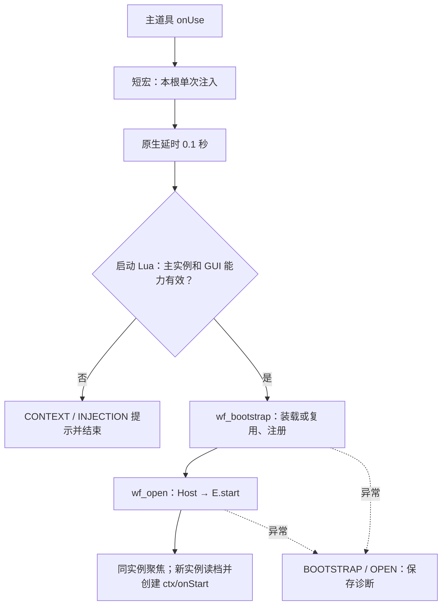

# TRP3 道具装配：工作流、内部对象与事件

状态：0.1.1 已在 WoW 12.1.0 / TRP3E 1061 跑通启动与自动基准；当前[完整候选](../items/performance-lab/README.md)为 0.2.0 有界纹理粒子及此前启动、音频和 Esc/关闭修复。第 4 节列实际生成的六个工作流，其余仍含后续规则设计；API 以引擎 README 为准。启动宏 253 字节，上限 255 字节，原生 0.1 秒延时必需。两个踩坑、版本和故障定位见[维护指南](ITEM-GAME-MAINTENANCE.md)、[FAQ](ITEM-GAME-FAQ.md)。

本文供引擎和构建器维护者使用；游戏作者从[游戏开发接入指南](ITEM-GAME-DEVELOPER-GUIDE.md)开始，只提交配置和 game.lua，以下工作流/内部对象由模板自动装配。

## 1. 交付物与边界

最终交付是一份 **TRP3 根物品及其内部对象的导出包**。引擎 Lua 是构建中间产物，不能只交付代码，再让玩家手工补工作流、文档或材料定义。

玩家导入/接收主道具后主动点击使用；接收动作本身不运行引擎、不发奖励、不重置进度。所有运行能力由本次使用建立，`/reload` 后再次使用重新建立。无需激活战役或长期光环。

两条分发路径分别说明：**原生交易接收**会取得背包实例；**导入导出码**在当前源码中先登记定义，玩家还需通过原生“添加到背包”取得实例。说明文档必须写明这一步，不能把导入定义当作已在背包获得道具。

三种对象要区分：

- **根定义和内部定义：** `class`、`class.SC`、`class.IN`，随发布版本共享，描述代码和内容。
- **背包实例：** `args.object` 及其 `vars`、`count`，描述这份道具的进度和数量。
- **运行实例：** 本次打开产生的 session、窗口、任务、输入和声音；退出即停止运行，不写进物品定义。

内部对象不等于背包槽位；把材料放进 `IN` 只是声明类型，只有经库存模块发放后才产生可交易实例。

## 2. 主道具编辑器配置

| 编辑器项目 | 对应字段 | 默认设置 |
| --- | --- | --- |
| 类型与编辑模式 | `TY`、`MD.MO` | 物品，专家模式；由目标版本的模板生成基础字段 |
| 名称、图标、说明 | `BA.NA / IC / DE` | 名称随游戏配置；说明操作方式、存档随道具、Musician 可选 |
| 可使用与使用文字 | `BA.US`、`US.AC` | 开启；“打开游戏” |
| 使用工作流 | `US.SC`、`LI.OU` | 两处统一为 `onUse`，避免事件绑定覆盖了另一入口 |
| 销毁事件 | `LI.OD` | 绑定 `wf_destroy`，只清理该物品对应场次 |
| 可堆叠 | `BA.ST` | 关闭；不以“堆叠上限很大”保存游戏进度 |
| 灵魂绑定与数量唯一 | `BA.SB`、`BA.UN` | 默认关闭/不设置；允许交换和多份独立进度 |
| 容器、可装备、任务物品 | `BA.CT / WA / QE` | 默认关闭；主道具本身不是游戏背包，也不要求战役 |
| 无法添加到背包 | `BA.PA` | 关闭，保证主道具可正常取得 |
| 使用消耗、施法延迟与循环 | 工作流内的对应效果/节点 | 不添加；打开界面不消耗主道具，不通过工作流延迟循环驱动游戏 |
| 对象版本 | `MD.V` | 每次发布递增；与引擎版本、存档版本分别记录 |
| 游戏事件表 | `HA` | 空表或不设置；普通物品不用它承接 WoW 全局事件 |

字段值从目标客户端的合法物品模板生成，表内布尔“关闭”优先沿用编辑器清空字段的方式，不凭设计文档伪造完整元数据。

## 3. 道具内部结构

```text
主道具 Root（唯一必需接收的物品）
├─ US.SC / LI.OU → onUse
├─ LI.OD → wf_destroy
├─ SC：onUse、wf_bootstrap、wf_open、wf_stop、wf_help、wf_destroy
└─ IN
   ├─ ig_help       文档：说明、操作、版本、常见问题
   ├─ ig_manifest   文档：包版本、对象目录、数据格式与校验信息
   ├─ ig_game       文档：角色、技能、敌人、物品映射与默认设置
   ├─ ig_assets     文档：模型、动画、碰撞模板、Sound 和内置 BGM
   ├─ ig_levels     文档：地形、出生点、刷怪、胜负和检查点
   ├─ ig_music      文档：可选 Musician 曲目数据及回退映射
   ├─ mat_token    物品：示例可堆叠材料的类型定义
   └─ gear_blade   物品：示例不可堆叠装备的类型定义
```

这些内部 ID 是首版装配约定，实际游戏可替换示例内容；发布后保持已发出物品所引用的 ID 稳定。ID 不含空格，完整 ID 用宿主的 `getFullID(rootId, innerId)` 组合；当前上游分隔符为空格。

| 内部对象 | 是否自动运行 | 读取/操作方式 |
| --- | --- | --- |
| `ig_help` | 否；默认不绑定文档打开/关闭事件 | `wf_help` 用 `document_show` 显示完整文档 ID；游戏内帮助按钮调用同一 Binding 接口 |
| `ig_manifest` | 否 | Binding 先检查游戏 ID、版本、必要对象和数据格式，再允许启动 |
| `ig_game / ig_assets / ig_levels` | 否 | 启动时读取文档 `PA[n].TX`，按构建器指定的顺序和格式解析；不打开文档窗口 |
| `ig_music` | 否 | 有 Musician 且选择对应曲目时异步读取/导入；缺失时走内置音乐或 Silent |
| `mat_token` | 否；材料默认不可使用、无工作流 | Inventory 创建实际库存实例；数量保存在 `count` |
| `gear_blade` | 仅玩家使用实际装备实例时 | 自己的 `onUse` 查看或请求装备该实例；词条保存在该实例 `o` 变量 |

数据文档中的 `SC / LI / HA` 默认为空。原始配置保持可验证的数据格式，不把文档文本当 Lua 执行；大文档需要分块时，每块有序号和明确解码规则，不能靠显示页顺序猜测拼接。

**引擎代码只在根物品的 `SC.wf_bootstrap` 中保留一份生成后的 Lua 脚本。** 同一个脚本还包含本游戏的 game.lua 工厂与 `Engine.registerGame(...)` 注册调用；它们属于代码，不写入数据文档。不把每个引擎模块各做成一个内部物品，也不在每件装备里嵌入整份引擎。

0.4.0 此脚本只装入选中的包及依赖；release 经过保留 token 和语法树的精简。可读源码、依赖锁和源码映射仅保存在本地，不在道具中再放一份。外层编码、安全元数据、六工作流和启动桥接保持原契约；详见[包管理指南](ITEM-GAME-PACKAGES.md)。

不建立 `saveData` 文档来保存玩家进度。修改内部文档会修改共享定义；进度必须留在主道具实例的 `o` 变量中。

## 4. 六个根工作流

当前的 ItemBinding 职责由构建器生成的 Lua 和 `host.lua` 完成，没有独立的 `ItemBinding.open` API。实际节点如下：

| 工作流 ID | 谁触发 | 当前实现 |
| --- | --- | --- |
| `onUse` | `US.SC / LI.OU`，宿主选择入口 | 短宏 → 原生 delay 0.1 秒 → Lua 检查主物品/GUI 能力，调用 wf_bootstrap |
| `wf_bootstrap` | 延时后的启动 Lua | 装载或复用相同 bundle，注册游戏，写 args.custom.ig_status=ready，再调用 wf_open；不同 bundle 先停止旧场次 |
| `wf_open` | wf_bootstrap | 读取 IN 配置，创建 Host，调用 E.start；检查窗口，记录成功或 OPEN 错误 |
| `wf_stop` | 外部工作流或调试调用 | 当前实例 o 变量 IG_CONTROL_V1=stop；活动 Runtime 监听/轮询后清理 |
| `wf_help` | 主动工作流调用 | IG_CONTROL_V1=pause，再 document_show 显示 Root ig_help；没有自动挂到所有启动错误分支 |
| `wf_destroy` | 根物品 LI.OD | IG_CONTROL_V1=destroy；背包通知和所有权复核兜底，停止后不向失效实例保存 |



使用当前性能台根 ID 时宏为 253 ASCII 字节，按原生 255 字节门槛检查。宏只匹配本根，单次使用或两秒超时后恢复；不能删除宏和 Lua 之间的延时，也不能假定 args._G 预先存在。

跨工作流由已注入代码调用 `TRP3_API.script.runWorkflow(args, "o", ...)`；调用链状态是 `args.custom.ig_status`，最近启动提示写 `o.IG_BOOT_STATUS_V1`。不把原生返回码、args.LAST 或 TRP3_ITEM_USED 当作 UI 已就绪证明。

Lua 效果的局部变量不会自动跨效果共享。引擎通过经过验证的宿主命名空间 `TRP3_ItemGame` 交接，调用链通过 args.custom 交接；生成工作流和 Host 仍会验证物品实例。高频主循环由 Runtime 承担。

### 4.2 哪些按钮不再绕工作流

移动、攻击、暂停、继续、切关、存档、音量开关、试听、交易按钮，默认直接调用引擎 API。`SC` 只处理物品边界，不建立 `wf_attack / wf_update / wf_play_each_note` 这样的高频工作流。

重开关卡只重建 World，不清永久进度；删除存档是另外的明确操作，默认不暴露为可被其他道具随意调用的根工作流。

## 5. 装备、材料与内部对象调用（含后续规则设计）

| 对象 | 物品属性 | 工作流/事件配置 |
| --- | --- | --- |
| 主道具 | 不堆叠、可使用、非容器 | 上述六个 `SC`，使用/销毁 `LI`，空 `HA` |
| 普通材料 | 允许堆叠、默认不可使用 | 不配置自动获得/交易/销毁奖励，不需要 `SC` |
| 独立装备 | 不堆叠、可使用、可交易 | 本对象 `US.SC = LI.OU = "onUse"`；自己的短脚本读取装备实例，尝试向活动游戏派发装备请求；无活动游戏时显示属性/提示先打开主道具 |
| 帮助和配置文档 | 内部文档，不作为背包容器 | 帮助按需展示；其余仅解析数据；默认 `LI.OO / LI.OC` 不绑定 |

装备使用时，`args.object` 是**装备本身**；不能把它交给主道具的 ItemStore 当作主存档。请求信封同时携带活动主道具引用和装备引用，Inventory 分别验证，再让装备系统更新 World。

内部装备的完整类型 ID 例如 `Root gear_blade`。它的定义父级是 Root，但库存父容器可能是普通背包；`run_workflow` 的 `p` 指库存父容器，`ch` 指容器中的子槽位，均不代表 `class.IN` 父子关系。跨定义调用统一走 Binding，禁止靠 `p` 猜根物品。

发放材料/装备必须经过 Inventory 并核对实际结果。原生 `item_add` 的目标 `self` 需要物品有容器能力；主道具默认不是容器，不能把内部对象当成可直接塞物品的槽位。初始化独立装备词条由创建该实例的库存操作完成，不能假定存在物品“生成时”的自动工作流。

## 6. 变量和上下文

| 内容 | 放在哪里 | 生命周期 |
| --- | --- | --- |
| `ig_request / ig_status / ig_error` | `w`，即 `args.custom` | 当前调用链；每次 onUse 初始化，不当作持久开关 |
| `IG_SAVE_V1 / IG_SAVE_BACKUP_V1` | 当前主道具 `o`，即实例 `vars` | 随该实例保存；不堆叠；读取时验证游戏和存档版本 |
| 装备属性 | 该装备实例 `o` | 随装备实例交易，不挪到主道具定义 |
| 材料数量 | TRP3 库存 `count` | 以实际背包数量为准 |
| 引擎/游戏/格式版本、内部 ID 映射 | `IN.ig_manifest` 的数据 | 包的定义版本；不能靠修改玩家存档来更新代码 |
| 当前 session、实体、输入状态、资源句柄 | 引擎内存 | 一次打开；不写 `o`，不写 `c`，不写共享定义 |

`ItemBinding` 为工作流/事件生成新请求上下文，校验 `rootClassID`、物品引用、当前版本、操作种类和 session 代次。不要长期保留整份可被后续原生工作流修改的 `args` 表；保存必要引用，每次持久化/交易前重验证。

从帮助文档进入的工作流，`classID` 可能是文档 ID，而 `object` 仍是打开它的父物品；文档回调还可能没有 `container`。这不是完整的背包使用上下文，不能直接拿来启动新存档或进行库存扣除。默认帮助文档因此不承载玩法按钮。

## 7. 三层事件表

### 7.1 TRP3 物品原生事件

| 事件 | 配置位置 | 处理 |
| --- | --- | --- |
| 使用主道具 | `US.SC / LI.OU → onUse` | 唯一正常启动入口 |
| 手动销毁主道具 | `LI.OD → wf_destroy` | 清理当前场次；不保存到即将销毁的实例 |
| 帮助文档打开/关闭 | `LI.OO / LI.OC` | 默认不绑定；关闭帮助不关闭主游戏 |
| 接收、导入、交易成功、进副本 | 不伪造 `LI` 字段 | 分别走主动使用、库存核对、运行期环境监听 |

当前上游只在 `manuallyDestroyed` 路径调用物品 `LI.OD`。交易移出、脚本消耗、脚本删除不会保证触发它；因此销毁工作流不是通用“物品离开背包”钩子。

普通物品、文档和对话的编辑器会隐藏游戏事件列表。根物品 `HA` 默认保持空；不为了接收事件而附加常驻光环，也不要求玩家激活战役。

### 7.2 运行期宿主事件

由 Host 通过 WoW 事件 Frame 或 `TRP3_API.RegisterCallback` 注册，Binding/Environment 归一化后交给模块。运行/暂停期间保持必要监听，退出统一解除。所有事件处理只影响本场拥有的物品和资源。

| 来源 | 时机与解释 | 模块动作 |
| --- | --- | --- |
| `PLAYER_ENTERING_WORLD`，可用时补充 `ZONE_CHANGED_NEW_AREA` | 进入世界/区域，重新读取副本类型 | Environment 决定继续允许、暂停或立即关闭 |
| `PLAYER_REGEN_DISABLED` | 角色进入 WoW 战斗 | 立即释放输入、关闭游戏；不等待固定逻辑帧 |
| `PLAYER_LEAVING_WORLD / PLAYER_LOGOUT` | 过图/离线 | 关闭或冻结，保存已确认检查点；取消音乐导入和声音 |
| `REFRESH_BAG` | 背包变化通知，可能同一操作多次触发；定义导入也可能发出 | 合并刷新；重新确认主道具和根定义版本；刷新材料与装备 |
| `ON_SLOT_USE / ON_SLOT_SWAP / ON_SLOT_REMOVE` | 宿主操作请求/分派事件，不能一概视为完成通知 | 只用作辅助线索；操作结果以库存重新读取为准，不重复执行操作 |
| `TRP3_ITEM_USED` | 原生使用工作流之后发出，携带类型 ID 与返回值 | 仅诊断或刷新；不再次启动 onUse，也不能据类型 ID 区分两份主道具 |
| `ON_OBJECT_UPDATED` | 定义发生变化；不假定一定携带目标 ID | 重新查询本场根定义版本；发生变化先暂停并停止旧场次，下一次主动使用再迁移/启动 |
| `SECURITY_CHANGED` | 宿主信任状态变化 | 重新检查能力；被阻止时停止调用并清理本场 |
| 窗口隐藏、文本焦点和按键回调 | GUI 生命周期与操作 | Input 清状态；窗口关闭进入同一个幂等退出入口 |

交易占用通过 `isInTransaction` 检查；交易前后由 Trade/Inventory 核对。本设计不假设存在通用 `TRP3_TRADE_COMPLETED`、`ON_ITEM_RECEIVED` 等原生事件。

`WORKFLOW_ON_LOADED` 是 TRP3 插件启动序列的通知，不是某个道具的工作流或导入完成事件；玩家使用道具时它通常早已发生。主道具被移出本地库存时，立即废弃待写入引用；不能把缓存存档写回已交易给对方的对象。

定义导入不保证发出 `ON_OBJECT_UPDATED`，因此 `REFRESH_BAG`、再次使用和运行期低频复核也检查根定义版本/清单标识。加载后的玩法数据使用本场解析快照，不长期依赖可能被导入替换或清空的 `class.IN` 表。

### 7.3 引擎内部事件（设计目标）

当前已发出的玩法事件为 combat.action、combat.hit、entity.died、inventory.changed；下面的其他事件族是规划，不能直接假定已有生产者。

| 事件族 | 生产者 | 消费者 |
| --- | --- | --- |
| `input.action` | Input / UI | Combat、交互系统 |
| `combat.hit / entity.died` | Combat | View、Sound、Level；奖励只有一个结算入口 |
| `level.checkpoint / level.complete` | Level | Runtime、ItemStore、Inventory、Music |
| `inventory.changed / trade.inventoryReconciled` | Inventory / Trade | 背包 UI、装备状态、待结算记录 |
| `music.ready / music.failed` | Music 后端 | Music 控制器、提示 UI；晚到回调必须检查 session |
| `runtime.stopRequested` | Environment / Binding / UI | Runtime；幂等停止，退出原因决定是否允许保存 |

这些是 Lua 事件，不注册成 TRP3 工作流事件，也不自动广播聊天或 `TRP3_SIGNAL`。大量命中、音符和渲染更新不会反复进入 TRP3 工作流解释/编译路径。

## 8. 各生命周期怎样落地

| 环节 | 默认处理 |
| --- | --- |
| 首次接收 | 只导入定义/取得物品；不执行初始化；第一次主动使用且没有有效存档时才建立初始快照 |
| 正常重开 | 重读该实例存档；不重复发新手物品；本场临时状态全部重新创建 |
| 重复使用 | 同一实例聚焦；不同实例需先停止旧场次，再用新上下文启动 |
| 暂停/打开帮助或交易 | 停止游戏输入与模拟；环境监听继续；恢复不补算暂停时间 |
| 检查点/退出 | 保存已确认进度；尚不确定的库存操作留核对记录，不自动补发 |
| 主道具交易 | 主动交易前保存并停止；已报价则冻结写入；对方主动使用后从收到的实例读档 |
| 主道具消耗、删除、丢弃 | `LI.OD` 或库存复核触发失效；停止且禁止向失效实例保存；不自建替代主道具 |
| 定义升级 | 停止旧版本；保留实例 `o`；下次使用检查并迁移 schema，不在 live World 上换代码 |
| 副本/战斗/异常关闭 | 先停输入与本场音频，尽力保存允许保存的检查点，再释放资源；不自动重开 |

主道具的“删除”和“重开关卡”是两种操作。禁止通过删除再添加一个新主道具实现普通退出或重开，否则会破坏实例存档与交易语义。

## 9. 构建、升级与验收

构建器应输出：完整引擎脚本 → 合法根物品结构（`BA / MD / US / SC / LI / IN`）→ 目标 TRP3/Extended 版本兼容的导出包 → 导入回读后的结构校验记录。

构建输入固定为游戏的 item.json、content.json、game.lua 和指定引擎版本；六个工作流来自引擎模板。第一次发布记住实际根 ID，后续相同游戏升级沿用；构建器不能每次构建都生成新的根 ID。

必须校验：

1. `US.SC`、`LI.OU`、`LI.OD` 指向存在的工作流；每个 `SC.*.ST` 都有入口节点 `"1"`，分支/后继引用有效。
2. 工作流只使用目标版本实际注册的效果；`wf_bootstrap` 只有一份引擎代码；没有主道具消耗、战役来源调用或永久循环延迟。
3. 所需 `IN` 存在、类型正确、ID 无空格；文档页和数据格式可解码；文档不开启自动运行事件。
4. 所有模型、曲目、关卡和物品引用可解析；可选 Musician 缺失时有回退；材料/装备数量和堆叠规则正确。
5. 发布模板不带作者的运行存档或未完成交易记录。分享模板和交易已有进度的实例分别验证，不把二者混为一种导出。
6. 同一产品升级保持根 ID 及已发出材料/装备的内部 ID；重命名/删除旧内部类型必须设计兼容。不能直接更换根 ID 后宣称旧物品仍可用。

原生交易内部材料时，宿主可能需要传输其整个根定义；大游戏包的首次交换成本也应实测。模板/曲目大小限制由导入和双客户端交易验证确定，不靠拆成玩家必需安装的多个道具解决。

最终真实路径：仅 TRP3/Extended → 接收一份道具 → 使用并显示 → 查看帮助 → 移动攻击 → 发放一个材料和一件有属性装备 → 双客户端交换 → 保存并重登 → 进入副本自动关闭 → 升级定义后恢复旧存档。额外覆盖手动销毁与脚本删除两条不同清理路径。

## 10. 已核对的依据

以下依据来自仓库固定 TRP3 Extended 源码；启动与自动负载已有首轮实机样本，完整交易、重登存档和退出生命周期仍未验收。

| 结论 | 源码 |
| --- | --- |
| 使用字段和专家事件仅有使用/销毁 | [Items/Editor/Normal.lua](../references/total-rp-3-extended/totalRP3_Extended_Tools/Items/Editor/Normal.lua)，`storeDataMain`、`linksStructure` |
| 普通物品不显示游戏事件列表 | [Links.lua](../references/total-rp-3-extended/totalRP3_Extended_Tools/Links/Links.lua)，`editor.load` |
| 使用对象上下文、使用后事件、手动销毁条件 | [Inventory.lua](../references/total-rp-3-extended/totalRP3_Extended/Inventory/Inventory.lua)，`doUseSlot`、`removeSlotContent` |
| 同对象/父容器工作流语义，custom 初始化、入口节点 | [ScriptGeneration.lua](../references/total-rp-3-extended/totalRP3_Extended/Script/ScriptGeneration.lua)，`runWorkflow`、`generateCode`、`executeClassScript` |
| 内部对象类型与 ID 无空格要求 | [Inner.lua](../references/total-rp-3-extended/totalRP3_Extended_Tools/Inner/Inner.lua)，`createInnerObject`、`addInnerObject` |
| 文档页数据、打开关闭及父物品上下文 | [Document/Editor/Normal.lua](../references/total-rp-3-extended/totalRP3_Extended_Tools/Document/Editor/Normal.lua)，`saveCurrentPage`；[Document.lua](../references/total-rp-3-extended/totalRP3_Extended/Document/Document.lua) |
| 事件名与完整定义 ID | [Main.lua](../references/total-rp-3-extended/totalRP3_Extended/Main.lua)，`TRP3_Extended.Events`、`getFullID` |
| 导入只登记定义，添加到背包是独立动作 | [List.lua](../references/total-rp-3-extended/totalRP3_Extended_Tools/List/List.lua)，`importFunction`、添加物品动作 |
| `WORKFLOW_ON_LOADED` 属于插件启动序列 | [totalRP3.lua](../references/total-rp-3/totalRP3/totalRP3.lua) |
